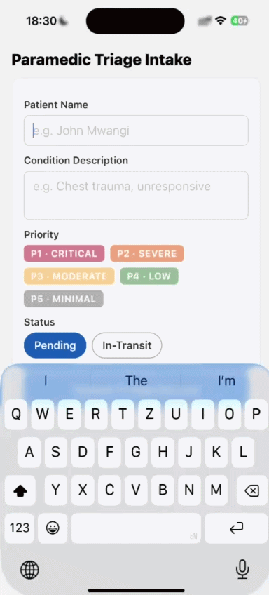

# 🚑 Paramedic Triage Intake

> **Offline-first mobile triage application built with React Native (Expo) and TypeScript.**
>
> Designed for emergency responders to record patient triage information even without internet connectivity. Every submission is stored locally first and automatically synchronized when the device reconnects.

<p align="center">
  
</p>

<p align="center">
  
</p>

---

## ✨ Features

- 📱 Offline-first architecture
- 💾 Instant local persistence using AsyncStorage
- 🔄 Automatic background synchronization
- 📡 Network connectivity detection using NetInfo
- ⚡ Optimistic UI with zero waiting during submission
- 🚑 Emergency priority classification (P1–P5)
- 📍 Patient status tracking
- 🧪 Unit tests with Jest

---

## 🛠 Tech Stack

| Technology | Purpose |
|------------|---------|
| React Native (Expo) | Mobile framework |
| TypeScript | Type safety |
| Zustand | State management |
| AsyncStorage | Local persistence |
| NetInfo | Connectivity detection |
| Jest + jest-expo | Unit testing |

---

# 🏗 Architecture

```
components/
├── TriageForm.tsx
├── RecordList.tsx
└── PriorityBadge.tsx

store/
└── useTriageStore.ts

services/
├── api.ts
├── storage.ts
├── sync.ts
└── types.ts

__tests__/
```

### Design Principles

- **Presentation Layer** → Pure React components
- **State Layer** → Zustand store
- **Persistence Layer** → AsyncStorage
- **Network Layer** → Mock API
- **Sync Layer** → Background synchronization

Each layer has a single responsibility, making the application easy to maintain, test, and extend.

---

# 🔄 Offline-First Synchronization

The application guarantees that **no patient record is lost because of network issues.**

### 1. Local First

When a paramedic submits a record:

- It is immediately saved to AsyncStorage.
- The UI updates instantly.
- No internet connection is required.

---

### 2. Sync Attempt

Immediately after saving, the app attempts to send the record using the mock API.

If offline, nothing fails—the record simply remains queued.

---

### 3. Automatic Retry

Queued records automatically retry when:

- The device reconnects to the internet.
- The application returns to the foreground.

No user interaction is required.

---

### 4. Safe Synchronization

A synchronization lock prevents multiple sync operations from running simultaneously.

Each queued record is processed independently, so one failed upload never blocks the others.

---

### 5. Live Status Updates

Every record displays its current synchronization state:

- 🟢 **SYNCED**
- 🟡 **QUEUED**

A banner also displays the total number of pending records waiting for synchronization.

---

# 🌐 Mock API

A real backend is intentionally omitted for this assessment.

Instead, `services/api.ts` simulates:

- `POST /api/v1/triage`
- ⏱ 2-second network delay
- ❌ 30% random network failure

This allows the offline queue and retry mechanism to be demonstrated realistically.

---

# 🚀 Getting Started

Install dependencies:

```bash
npm install
```

Start Expo:

```bash
npx expo start
```

Run on Android:

```bash
npm run android
```

Run on iOS:

```bash
npm run ios
```

---

# 🧪 Running Tests

```bash
npm test
```

---

# 📽 Demonstrating Offline Mode

1. Enable Airplane Mode.
2. Create and submit a triage record.
3. Observe the record being saved immediately with a **QUEUED** status.
4. Disable Airplane Mode.
5. Wait a few seconds.
6. The queued record automatically changes to **SYNCED** without any user action.

---

# 📂 Project Structure

```
.
├── assets/
│   ├── paramedic-triage-demo.gif
│   └── app-screenshot.jpg
│
├── components/
├── services/
├── store/
├── __tests__/
│
├── App.tsx
├── package.json
└── README.md
```

---

# 📌 Assessment Notes

This project demonstrates:

- Offline-first mobile application design
- Local-first data persistence
- Automatic background synchronization
- Separation of concerns
- Clean architecture
- State management with Zustand
- Resilient handling of intermittent network connectivity
- Testable service and storage layers